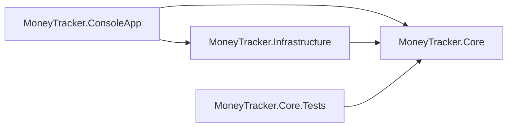
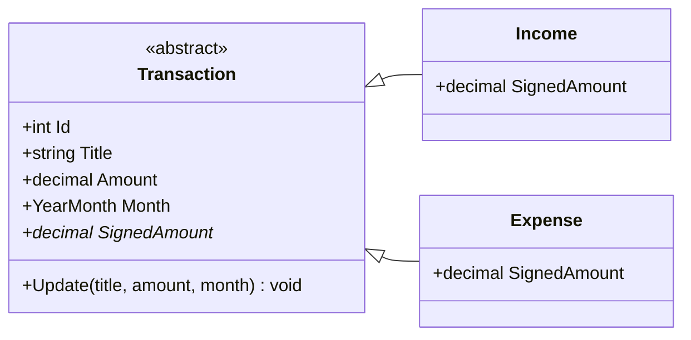
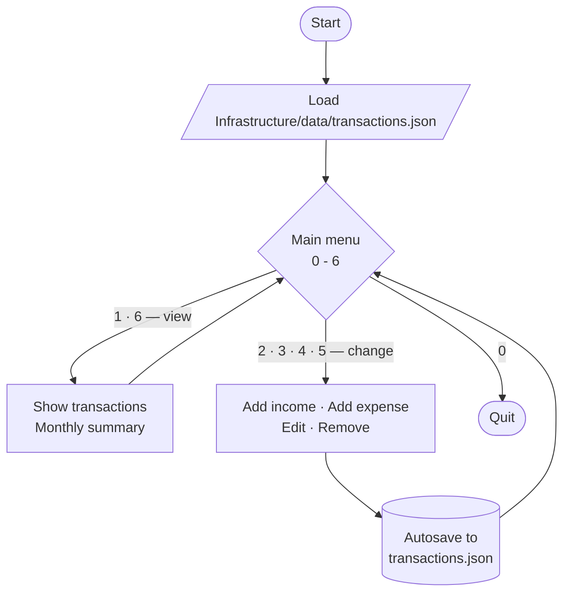

# MoneyTracker

A console application for tracking personal income and expenses by month, written in C# on .NET 10.

> Course milestone project — <!-- TODO: course name, school, term -->
> Author: Niclas Hugdahl

---

## Table of contents

- [About](#about)
- [Features](#features)
- [Requirements from the brief](#requirements-from-the-brief)
- [Getting started](#getting-started)
- [Usage](#usage)
- [Project structure](#project-structure)
- [Architecture](#architecture)
- [Domain model](#domain-model)
- [Application flow](#application-flow)
- [Data storage](#data-storage)
- [Design decisions](#design-decisions)
- [Planning and documentation](#planning-and-documentation)
- [Roadmap](#roadmap)

---

## About

MoneyTracker lets you record incomes and expenses, assign each one to a month, and review them
through a text-based menu. Entries can be listed, sorted, filtered, edited and removed. All data
is stored in a JSON file and restored the next time the application starts.

The project is built as a multi-project solution with a deliberate separation between the domain,
persistence, and user interface — the dependency direction is enforced by the compiler rather
than by convention.

<!-- TODO: add a screenshot of the running app -->
<!--  -->

---

## Features

- Record **incomes** and **expenses**, each with a title, amount and month
- **Sort** by month, amount or title, ascending or descending
- **Filter** to show only incomes, only expenses, or everything
- **Edit** and **remove** existing entries
- **Balance summary** — total income, total expenses and net balance, overall or per month
- **Autosave** after every add, edit and delete, not only on quit
- **Crash-safe writes** — data is written to a temporary file and then moved into place, so an
  interrupted save cannot leave a half-written file
- Amounts accept both `1234,50` and `1234.50`
- Swedish currency formatting (`sv-SE`, SEK)

---

## Requirements from the brief

| # | Requirement | Status | Implemented by |
|---|-------------|--------|----------------|
| 1 | Model an item with title, amount and month, distinguishing income from expense | ⬜ | `Transaction` (abstract) with `Income` / `Expense` |
| 2 | Display a collection sortable ascending/descending by month, amount or title | ⬜ | `TransactionService.GetTransactions` |
| 3 | Display only expenses or only incomes | ⬜ | `TransactionFilter` |
| 4 | Edit and remove items | ⬜ | `TransactionService.Update` / `.Remove` |
| 5 | Text-based user interface | ⬜ | `MoneyTracker.ConsoleApp` |
| 6 | Load and save the item list to file | ⬜ | `ITransactionRepository` / `JsonTransactionRepository` |

<!-- TODO: flip ⬜ to ✅ as each one lands -->

---

## Getting started

### Prerequisites

- [.NET 10 SDK](https://dotnet.microsoft.com/download) (10.0.401 or later)

Check what you have:

```bash
dotnet --version
```

### Build and run

```bash
git clone <repository-url>
cd CsharpMilestoneProject

dotnet build
dotnet run --project src/MoneyTracker.ConsoleApp
```

### Run the tests

```bash
dotnet test
```

---

## Usage

The application opens on the main menu and returns to it after every action:

```
=== MoneyTracker ===
Balance: 22 500,00 kr   (income 32 000,00 kr · expenses 9 500,00 kr)

1. Show transactions
2. Add income
3. Add expense
4. Edit transaction
5. Remove transaction
6. Monthly summary
0. Quit

Select option (0 - 6):
```

Listing transactions asks for a filter, then a sort field, then a direction:

```
  ID  Type      Title                    Month      Amount
  ──  ────────  ───────────────────────  ───────  ──────────
   1  Income    Lön                      2026-09   32 000,00
   2  Expense   Hyra                     2026-09   -9 500,00
```

Months are entered as `YYYY-MM`, for example `2026-09`.

---

## Project structure

```
CsharpMilestoneProject/
├── MoneyTracker.slnx              # solution (.NET 10 XML format)
├── Directory.Build.props          # MSBuild settings shared by every project
├── CLAUDE.md                      # coding rules for AI assistance
├── docs/
│   ├── PROJECT_CONTEXT.md         # full design document
│   ├── class-diagram.md           # complete UML, Mermaid source
│   └── class-diagram.png          # rendered UML
├── src/
│   ├── MoneyTracker.Core/         # domain models and business logic
│   ├── MoneyTracker.Infrastructure/  # JSON persistence
│   └── MoneyTracker.ConsoleApp/   # console UI and composition root
└── tests/
    └── MoneyTracker.Core.Tests/   # xunit tests
```

---

## Architecture

Four projects, with dependencies pointing inward toward the domain:



`MoneyTracker.Core` references no other project in the solution. It defines the
`ITransactionRepository` interface; `MoneyTracker.Infrastructure` implements it with JSON. This is
the **dependency inversion principle** — the domain declares what it needs, and the outer layer
supplies it.

The practical benefit: because `Core` has no reference to the other projects, it is a compile
error for a domain class to reach into persistence or the UI. Swapping JSON for a database, or
the console for a different front end, touches one project and leaves the domain untouched.

---

## Domain model

Income and expense are distinguished by **inheritance** rather than a flag or an enum:



`Amount` is always a **positive** `decimal`. The subclass decides what that amount means:
`Income.SignedAmount` returns `+Amount`, `Expense.SignedAmount` returns `-Amount`.

Every calculation in the application then reduces to:

```csharp
decimal balance = transactions.Sum(t => t.SignedAmount);
```

There is no `if (isExpense)` anywhere, and no `switch` on a type enum. Adding a new kind of
transaction would mean adding a subclass, not editing every calculation — this is polymorphism
doing the work.

📄 **[Full class diagram →](docs/class-diagram.md)** (all classes, interfaces and enums across the
three projects)

---

## Application flow



The menu options split cleanly in two. Options that only *read* return straight to the menu;
options that *change* data all converge on the same save step, so the file on disk is always
current. There is no separate "save" command to forget — quitting writes nothing new.

---

## Data storage

Transactions are stored as a JSON array. The `type` field is a polymorphic discriminator written
by `System.Text.Json`, and is what allows the correct subclass to be reconstructed on load:

```json
[
  { "type": "income",  "id": 1, "title": "Lön",  "amount": 32000.00, "month": "2026-09" },
  { "type": "expense", "id": 2, "title": "Hyra", "amount": 9500.00,  "month": "2026-09" }
]
```

The file lives at `src/MoneyTracker.Infrastructure/data/transactions.json`, inside the source
tree so it's committed to the repo and ships with sample data for graders. It is created on first
save if missing; a missing file is treated as an empty list, not an error. It is generated state
and should not be edited by hand — let the app write to it.

---

## Design decisions

| Decision | Reasoning |
|----------|-----------|
| Inheritance over an enum for income/expense | Keeps the sign out of every calculation; the type itself carries the behaviour |
| `Amount` always positive | A negative expense amount would be ambiguous — is it a refund? The sign belongs to the subclass |
| `decimal`, never `double` | Binary floating point cannot represent `0.1` exactly, and money arithmetic must be exact |
| A dedicated `YearMonth` type | A bare `int Month` would merge January 2026 with January 2027; `DateOnly` would invent a day the user never entered |
| Repository behind an interface | Lets the domain be tested without touching the file system, and makes per-user files a one-line change later |
| Autosave rather than save-on-quit | A crash or an accidental window close cannot lose work |
| Atomic writes (temp file, then move) | Because saves are frequent, an interrupted write must not corrupt the data file |

📄 **[Full design document →](docs/PROJECT_CONTEXT.md)**

---

## Planning and documentation

| Document | Contents |
|----------|----------|
| [`docs/PROJECT_CONTEXT.md`](docs/PROJECT_CONTEXT.md) | Complete design: requirements mapping, solution layout, domain model, service API, persistence, validation rules, conventions, build order |
| [`docs/class-diagram.md`](docs/class-diagram.md) | Full UML class diagram (Mermaid source) |
| [`CLAUDE.md`](CLAUDE.md) | Condensed coding rules — architecture boundaries, naming, what is out of scope |

The design was settled before any code was written: requirements were mapped to classes, the UML
diagram was drawn, and the architectural rules were written down. The build order in
`PROJECT_CONTEXT.md` §10 follows the dependency graph — `Core` first, then `Infrastructure`,
then the UI.

---

## Roadmap

Planned, designed for, but not yet implemented:

- [ ] **Unit tests** — `TransactionService` already takes an interface, so tests can use an
      in-memory fake repository and touch no files
- [ ] **Colourful console UI** — a full theming pass using
      [Spectre.Console](https://spectreconsole.net/). All rendering is already isolated in
      `TransactionTable` and `ConsoleMessage`, so only those change
- [ ] **User login** (deliberately insecure — no password hashing, this is a learning exercise)
      — one JSON file per user at `data/{username}.json`. The repository already takes a file
      path, so the change is confined to `Program.cs`

---

<!-- TODO: add a licence section if your course requires one -->
