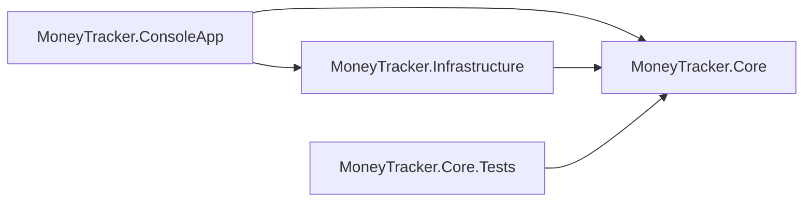

# MoneyTracker — Class Diagram

Mermaid source. Renders natively on GitHub and in the VS Code / Rider Markdown preview.

## Class diagram

```mermaid
classDiagram
    direction TB

    namespace Core {
        class Transaction {
            <<abstract>>
            +int Id
            +string Title
            +decimal Amount
            +YearMonth Month
            +decimal SignedAmount*
            #Transaction(int id, string title, decimal amount, YearMonth month)
            +Update(string title, decimal amount, YearMonth month) void
        }
        class Income {
            +decimal SignedAmount
        }
        class Expense {
            +decimal SignedAmount
        }
        class YearMonth {
            +int Year
            +int Month
            +FromDate(DateOnly date)$ YearMonth
            +TryParse(string input, out YearMonth result)$ bool
            +CompareTo(YearMonth other) int
            +ToString() string
        }
        class BalanceSummary {
            +decimal TotalIncome
            +decimal TotalExpenses
            +decimal Balance
        }
        class TransactionFilter {
            <<enumeration>>
            All
            IncomesOnly
            ExpensesOnly
        }
        class SortField {
            <<enumeration>>
            Month
            Amount
            Title
        }
        class SortDirection {
            <<enumeration>>
            Ascending
            Descending
        }
        class ITransactionRepository {
            <<interface>>
            +Load() IReadOnlyList~Transaction~
            +Save(IEnumerable~Transaction~ transactions) void
        }
        class TransactionService {
            -ITransactionRepository _repository
            -List~Transaction~ _transactions
            -int _nextId
            +GetTransactions(TransactionFilter filter, SortField sortBy, SortDirection direction) IReadOnlyList~Transaction~
            +FindById(int id) Transaction
            +AddIncome(string title, decimal amount, YearMonth month) Income
            +AddExpense(string title, decimal amount, YearMonth month) Expense
            +Update(int id, string title, decimal amount, YearMonth month) Transaction
            +Remove(int id) void
            +GetSummary(YearMonth month) BalanceSummary
            -Persist() void
        }
        class TransactionNotFoundException {
            +int TransactionId
        }
        class DataStoreException {
            +DataStoreException(string message, Exception inner)
        }
    }

    namespace Infrastructure {
        class JsonTransactionRepository {
            -string _filePath
            -JsonSerializerOptions s_options$
            +Load() IReadOnlyList~Transaction~
            +Save(IEnumerable~Transaction~ transactions) void
            -WriteAtomically(string json) void
        }
        class YearMonthJsonConverter {
            +Read(...) YearMonth
            +Write(...) void
        }
    }

    namespace ConsoleApp {
        class Program {
            +Main(string[] args)$ void
        }
        class MainMenu {
            -TransactionService _service
            +Run() void
            -ShowTransactions() void
            -AddIncome() void
            -AddExpense() void
            -EditTransaction() void
            -RemoveTransaction() void
            -ShowSummary() void
        }
        class ConsoleInput {
            +ReadMenuChoice(string prompt, int min, int max)$ int
            +ReadText(string prompt, string current)$ string
            +ReadAmount(string prompt, decimal current)$ decimal
            +ReadYearMonth(string prompt, YearMonth current)$ YearMonth
            +Confirm(string prompt)$ bool
        }
        class TransactionTable {
            +Render(IReadOnlyList~Transaction~ transactions)$ void
            +RenderSummary(BalanceSummary summary)$ void
        }
        class ConsoleMessage {
            +Success(string text)$ void
            +Warning(string text)$ void
            +Error(string text)$ void
        }
    }

    Transaction <|-- Income
    Transaction <|-- Expense
    Transaction *-- YearMonth
    TransactionService o-- "0..*" Transaction : manages
    TransactionService --> ITransactionRepository : uses
    TransactionService ..> BalanceSummary : creates
    TransactionService ..> TransactionFilter : uses
    TransactionService ..> SortField : uses
    TransactionService ..> SortDirection : uses
    TransactionService ..> TransactionNotFoundException : throws
    JsonTransactionRepository ..|> ITransactionRepository : implements
    JsonTransactionRepository --> YearMonthJsonConverter : registers
    JsonTransactionRepository ..> DataStoreException : throws
    Program ..> JsonTransactionRepository : creates
    Program ..> TransactionService : creates
    Program ..> MainMenu : runs
    MainMenu --> TransactionService : uses
    MainMenu ..> ConsoleInput : uses
    MainMenu ..> TransactionTable : uses
    MainMenu ..> ConsoleMessage : uses
```

Notes the diagram can't express:

- `Income`, `Expense`, `MainMenu`, `JsonTransactionRepository` and `YearMonthJsonConverter` are `sealed`.
- `YearMonth` and `BalanceSummary` are `readonly record struct`.
- `ConsoleInput`, `TransactionTable` and `ConsoleMessage` are `static` classes (the `$` marks their static members).
- `TransactionNotFoundException` and `DataStoreException` derive from `Exception`.
- `SignedAmount` (marked `*`) is abstract on `Transaction`; `Income` returns `+Amount`, `Expense` returns `-Amount`.

## Project references (dependency direction)

`Core` references nothing. Arrows mean "has a project reference to".
