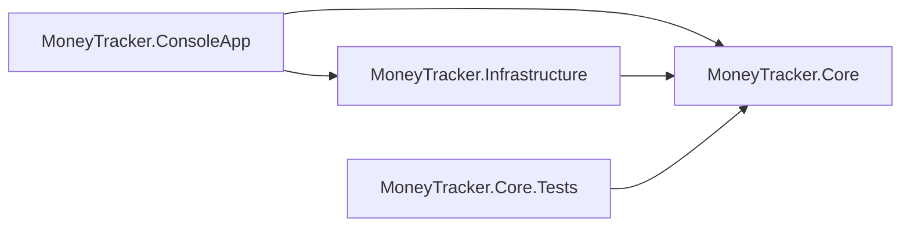

# MoneyTracker — Class Diagram

Mermaid source. Renders natively on GitHub and in the VS Code / Rider Markdown preview.

## Class diagram

```mermaid
classDiagram
    direction TB

    namespace Core {
        class Transaction {
            <<abstract>>
            +int MaxTitleLength$
            +decimal MaxAmount$
            +int Id
            +string Title
            +decimal Amount
            +YearMonth Month
            +decimal SignedAmount*
            +string TypeName*
            #Transaction(int id, string title, decimal amount, YearMonth month)
            +Update(string title, decimal amount, YearMonth month) void
        }
        class Income {
            +decimal SignedAmount
            +string TypeName
        }
        class Expense {
            +decimal SignedAmount
            +string TypeName
        }
        class YearMonth {
            +int MinYear$
            +int MaxYear$
            +int Year
            +int Month
            +YearMonth Current$
            +TryParse(string value, out YearMonth result)$ bool
            +CompareTo(YearMonth other) int
            +ToString() string
        }
        class BalanceSummary {
            +decimal TotalIncome
            +decimal TotalExpenses
            +decimal Balance
        }
        class TransactionFilter {
            <<enumeration>>
            All
            IncomesOnly
            ExpensesOnly
        }
        class SortField {
            <<enumeration>>
            Month
            Amount
            Title
        }
        class SortDirection {
            <<enumeration>>
            Ascending
            Descending
        }
        class ITransactionRepository {
            <<interface>>
            +Load() IReadOnlyList~Transaction~
            +Save(IEnumerable~Transaction~ transactions) void
        }
        class TransactionService {
            -ITransactionRepository _repository
            -List~Transaction~ _transactions
            -int _nextId
            +GetTransactions(TransactionFilter filter, SortField sortBy, SortDirection direction) IReadOnlyList~Transaction~
            +GetTotal(TransactionFilter filter) decimal
            +FindById(int id) Transaction
            +GetTransactionsForMonth(YearMonth? month) IReadOnlyList~Transaction~
            +GetAvailableMonths() IReadOnlyList~YearMonth~
            +AddIncome(string title, decimal amount, YearMonth month) Income
            +AddExpense(string title, decimal amount, YearMonth month) Expense
            +Update(int id, string title, decimal amount, YearMonth month) Transaction
            +Remove(int id) void
            +GetSummary(YearMonth? month) BalanceSummary
            -Persist() void
        }
        class TransactionNotFoundException {
            +int Id
        }
        class DataStoreException {
            +DataStoreException(string message, Exception innerException)
        }
    }

    namespace Infrastructure {
        class JsonTransactionRepository {
            -string _path
            -JsonSerializerOptions _options
            +Load() IReadOnlyList~Transaction~
            +Save(IEnumerable~Transaction~ transactions) void
        }
        class YearMonthJsonConverter {
            +Read(...) YearMonth
            +Write(...) void
        }
    }

    namespace ConsoleApp {
        class Program {
            <<top-level statements>>
        }
        class MainMenu {
            -TransactionService _service
            -TransactionMenu _transactionMenu
            +Run() void
            -RunMenuLoop() void
            -PrintSummary(BalanceSummary summary)$ void
        }
        class TransactionMenu {
            -TransactionService _service
            +ShowTransactions() void
            +AddIncome() bool
            +AddExpense() bool
            +EditTransaction() void
            +RemoveTransaction() void
            +ShowMonthlySummary() void
        }
        class ConsoleInput {
            +ValidateInput(string prompt, int maxLength, bool allowCancel, string? currentValue)$ string
            +ValidateInput~T~(string prompt, Func validator, string errorMessage, bool allowCancel, bool hasCurrentValue, T currentValue)$ T
            +ValidateIntegerRange(int min, int max)$ Func
            +SelectMenuOption(IReadOnlyList~string~ menuItems, string zeroLabel, IReadOnlyDictionary~int,string~? disabledChoices)$ int
            +SelectEnumOption~T~(T current)$ T
            +EnumDisplayName~T~(T value)$ string
            +Confirm(string message)$ bool
            +Pause()$ void
            +TryRun(Action action)$ void
            +TryRun(Func~bool~ action)$ void
        }
        class TransactionTable {
            +Display(IReadOnlyList~Transaction~ transactions)$ int?
        }
        class ConsoleMessage {
            +DisplayErrorMessage(string message)$ void
            +DisplaySuccessMessage(string message)$ void
            +DisplayWarningMessage(string message)$ void
            +WriteColored(string text, ConsoleColor color)$ void
            +WriteColoredLine(string text, ConsoleColor color)$ void
            +Heading(string title, ConsoleColor color)$ void
            +MainHeading(string title, ConsoleColor color)$ void
        }
        class SlowConsole {
            +Install()$ void
            +TypeTextSlow(string text)$ void
        }
        class UserCancelledException
    }

    Transaction <|-- Income
    Transaction <|-- Expense
    Transaction *-- YearMonth
    TransactionService o-- "0..*" Transaction : manages
    TransactionService --> ITransactionRepository : uses
    TransactionService ..> BalanceSummary : creates
    TransactionService ..> TransactionFilter : uses
    TransactionService ..> SortField : uses
    TransactionService ..> SortDirection : uses
    TransactionService ..> TransactionNotFoundException : throws
    JsonTransactionRepository ..|> ITransactionRepository : implements
    JsonTransactionRepository --> YearMonthJsonConverter : registers
    JsonTransactionRepository ..> DataStoreException : throws
    Program ..> JsonTransactionRepository : creates
    Program ..> TransactionService : creates
    Program ..> MainMenu : creates and runs
    Program ..> SlowConsole : installs
    MainMenu --> TransactionService : uses
    MainMenu --> TransactionMenu : delegates to
    MainMenu ..> UserCancelledException : catches
    TransactionMenu --> TransactionService : uses
    TransactionMenu ..> ConsoleInput : uses
    TransactionMenu ..> TransactionTable : uses
    TransactionMenu ..> ConsoleMessage : uses
    ConsoleInput ..> ConsoleMessage : uses
    ConsoleInput ..> UserCancelledException : throws
    UserCancelledException --|> Exception
    TransactionNotFoundException --|> Exception
    DataStoreException --|> Exception
```

Notes the diagram can't express:

- `Income`, `Expense`, `MainMenu`, `TransactionMenu`, `JsonTransactionRepository`, `YearMonthJsonConverter`
  and `UserCancelledException` are `sealed`.
- `YearMonth` and `BalanceSummary` are `readonly record struct`.
- `ConsoleInput`, `TransactionTable`, `ConsoleMessage` and `SlowConsole` are `static` classes
  (the `$` marks their static members).
- `TransactionNotFoundException`, `DataStoreException` and `UserCancelledException` derive from
  `Exception`.
- `SignedAmount` and `TypeName` (marked `*`) are abstract on `Transaction`; `Income` and `Expense`
  each override both — no `if (isExpense)` or type check anywhere in the app.
- `Program` has no class declaration in code — it's C# top-level statements, shown here as a
  class only to represent the composition root's relationships.
- `MainMenu` owns only the top-level menu loop and its "Quit" condition; each of the six actions
  is delegated to `TransactionMenu`, which owns pagination, filtering/sorting-in-place, add,
  edit, remove and the monthly summary screen.

## Project references (dependency direction)

`Core` references nothing. Arrows mean "has a project reference to".
